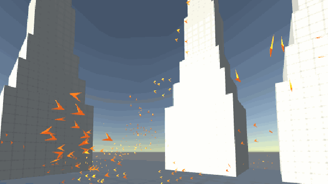
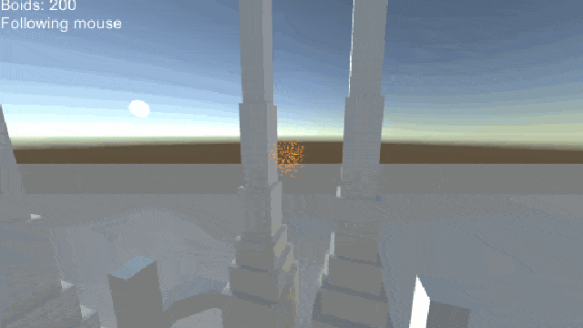

# GPU boids
#### An implementation of the Boids algorithm (Reynolds, C. W. (1987) Flocks, Herds, and Schools: A Distributed Behavioral Model) for Unity. Utilises compute shaders to significantly improve performance vs. a typical CPU-based implementation.
|  |  |  |
|:----:|:----:|:----:|

## About
This is a Unity implementation of Craig Reynold's *Boids* algorithm (http://www.cs.toronto.edu/~dt/siggraph97-course/cwr87/). Essentially, the system is formed of several "boid" particles which react dynamically to each other and to the environment in a manner similar to a flock of birds or a school of fish.

## Controls

 WASD - move camera   
LMB - toggle mouse follow on/off 

## Features
### Reaction to other boids
Each boid attempts to:
* Stay a certain distance from other boids
* Match velocity with that of nearby boids
* Move towards the centre of nearby boids

### Boid affectors
Affectors are objects placed in the scene which influence the movement of a boid which enters its range. There are currently three types of affectors:
* Attractor - pulls boids within its range into its centre
* Repulsor - repels boids that come within its range
* Pusher - pushes boids that come within its range in a predefined direction

### Cursor follow
Boids may be set to follow a 3D target. In the demo, this is controlled by the player's mouse position.

## Implementation
### GPU flocking
The boids' flocking behaviour is implemented using compute shaders; this allows the behaviour of many boids to be calculated in parallel, and provides a significant performance increase over a typical CPU-based implementation.

### Batched flocking
This is a variant of the basic GPU flocking which divides the flock into batches of boids and executes each batch on consecutive frames; thus, the entire flock is updated over n frames, where n is the number of batches the flock is divided into.
With large flocks, and when the number of batches is kept small (<8 frames is good) this method provides a great performance boost with no discernible impact to boid behaviour.

## Performance
In informal testing, using an Nvidia RTX 2060 GPU, this implementation achieves around 60 frames per second on a flock of ~30000 boids without batching, and 110-120 frames per second with batching over 4 frames.

###### Christopher Kirkham, 2020